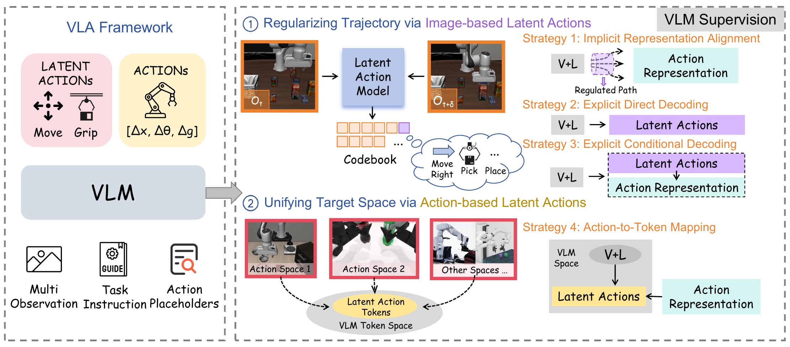
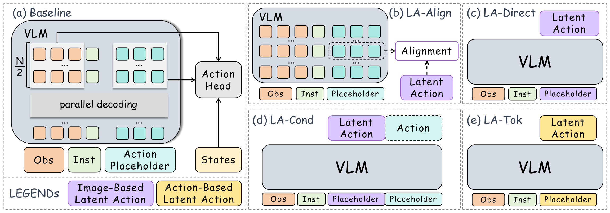
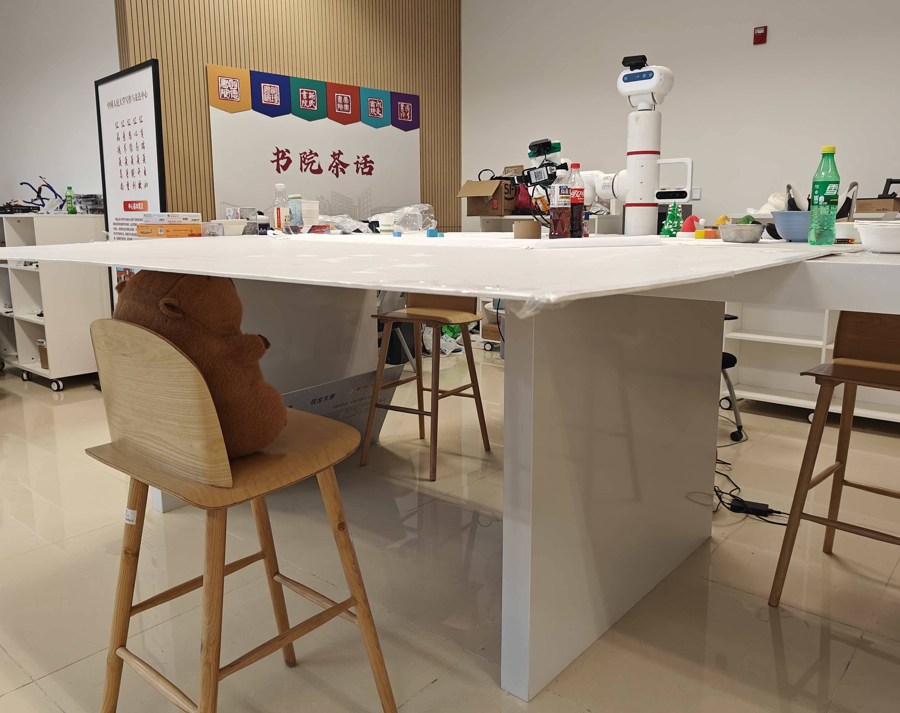

<div align="center">
  <h1>From Pixels to Tokens: A Systematic Study of Latent Action Supervision for Vision-Language-Action Models</h1>
  <p>
    <strong>Language / 语言:</strong> <a href="./README.md">English</a> | <strong>中文</strong>
  </p>
  <p>
    <a href="#潜在动作模型训练"></a>
    <a href="#训练"></a>
    <a href="#方法"></a>
  </p>
</div>

<p align="center">
  
</p>

## 概述

本工作研究了在统一训练框架下，如何将 latent action supervision 引入 Vision-Language-Action (VLA) models。我们重点分析不同 latent supervision strategies 对下游 VLA policy learning 的影响。

我们的实现基于统一的 `Qwen3-VL-2B` backbone，并比较了四种代表性策略：

| 模型        | Latent supervision          | 在 VLA training 中的作用                              |
| ----------- | --------------------------- | ----------------------------------------------------- |
| `Baseline`  | None                        | 不使用 latent supervision，直接预测 action            |
| `LA-Align`  | Image-based latent actions  | 将 VLM 内部 representations 与 latent embeddings 对齐 |
| `LA-Direct` | Image-based latent actions  | 将 latent actions 直接解码为离散 tokens               |
| `LA-Cond`   | Image-based latent actions  | 联合解码 latent actions 和 action representations     |
| `LA-Tok`    | Action-based latent actions | 将 actions 映射到离散 latent tokens                   |

本项目从论文中的两个互补视角展开：

- Image-based latent actions for trajectory regularization
- Action-based latent actions for target-space unification

## 方法

<p align="center">
  
</p>

所有方法共享同一个 VLA backbone 和 action head，差异仅在于 latent supervision 的注入方式。主要的 VLA 实现位于 [`latentvla/models/vla`](./latentvla/models/vla)。

## 安装

在项目根目录安装依赖：

```bash
pip install -r requirements.txt
```

## 数据准备

本仓库默认使用 RLDS format 数据，适用于 latent action preprocessing 和 VLA training。

本项目使用到的公开 RLDS datasets 包括：

- [LIBERO](https://huggingface.co/datasets/openvla/modified_libero_rlds)
- [RoboTwin 2.0](https://huggingface.co/datasets/TianxingChen/RoboTwin2.0)
- [JAKA dataset](https://huggingface.co/CokeAnd1ce/From_Pixels_to_Tokens)

下载并在本地整理完成后，将 `data_root_dir` 指向 dataset root directory。

## 潜在动作模型训练

### A. Image-based latent action model

Image-based latent action model 位于 [`data_preprocess/image_based_lam`](./data_preprocess/image_based_lam)。它遵循 UniVLA 风格的 image-based latent action pipeline，用于为 `LA-Align`、`LA-Direct` 和 `LA-Cond` 生成 latent supervision。

在你的 dataset 上进行 post-training 之前，请先下载两个公开的 [UniVLA(RSS2025) checkpoints](https://github.com/OpenDriveLab/UniVLA)：

- Stage-1 checkpoint
- Stage-2 checkpoint

这些 checkpoints 作为 initialization 使用，因为这里执行的是 dataset-specific post-training，而不是从零开始完整训练 image-based latent model。

#### 训练

编辑 [`data_preprocess/image_based_lam/config/lam-stage-2.yaml`](./data_preprocess/image_based_lam/config/lam-stage-2.yaml)：

- `model.lam_path`
- `model.stage_one_ckpt`
- `data.data_root_dir`
- `data.data_mix`
- `trainer.devices`
- logging 和 checkpoint 保存路径

然后运行：

```bash
cd data_preprocess/image_based_lam
torchrun --standalone --nnodes 1 --nproc-per-node 1 main.py fit \
  --config config/lam-stage-2.yaml
```

### B. 使用 image-based latent labels 标注 RLDS data

完成 image-based model 训练后，使用 [`data_preprocess/image_based_lam/latent.py`](./data_preprocess/image_based_lam/latent.py) 为 trajectories 添加 latent labels。当前脚本给出了一个 `LIBERO` 风格的 TFRecord 示例，并会写入：

- `steps/latent_idx`
- `steps/latent_z`

运行前，请先修改脚本中的 checkpoint path：

```python
lam_path = "your_lam_checkpoint.pth"
```

然后运行：

```bash
cd data_preprocess/image_based_lam
python latent.py /path/to/file.tfrecord
```

脚本会在输入文件旁边的同级 `output/` 目录中写出新的 TFRecord file。

### C. Action-based latent action model

Action-based latent action model 位于 [`data_preprocess/action_based_lam`](./data_preprocess/action_based_lam)。该模型在本仓库中从零训练，并用于 `LA-Tok`。

该 tokenizer 会在 action chunks 上学习一个 VQ-style 的离散 latent space，并保存形如 `tokenizer_step_*.pt` 的 checkpoints。

编辑 [`data_preprocess/action_based_lam/action.sh`](./data_preprocess/action_based_lam/action.sh) 后即可启动训练：

- `--data-root-dir`
- `--data-mix`
- `--results-dir`
- `--num-steps`

运行：

```bash
cd data_preprocess/action_based_lam
bash action.sh
```

## 训练

主训练入口为 [`exp/train_vla.py`](./exp/train_vla.py)。

在开始 VLA training 之前，先下载 `Qwen3-VL-2B` [checkpoint](https://huggingface.co/Qwen/Qwen3-VL-2B-Instruct)，并设置：

```bash
--vlm_path /path/to/Qwen3-VL-2B
```

simulation benchmark 的 checkpoints 可在 Hugging Face 获取：[simulation benchmark ckpts](https://huggingface.co/CokeAnd1ce/From_Pixels_to_Tokens)

支持的 `--vla_id` 包括：

- `baseline`
- `la_align`
- `la_direct`
- `la_cond`
- `la_tok`

在启动 training 前，请确认至少设置以下参数：

- `--vlm_path`：下载好的 `Qwen3-VL-2B` checkpoint 路径
- `--data_root_dir`：RLDS dataset root
- `--data_mix`：目标 dataset split 或 mixture
- `--action_tokenizer_ckpt`：训练 `la_tok` 时需要设置
- `--pretrained_checkpoint` 和 `--from_pretrained True`：当你需要加载完成训练的 checkpoint 继续 training 或 evaluation 时设置

`baseline` 示例命令：

```bash
torchrun --nnodes=1 --nproc_per_node=1 exp/train_vla.py \
  --seed 42 \
  --run_root_dir runs \
  --save_checkpoint True \
  --vla_id baseline \
  --vlm_path /path/to/Qwen3-VL-2B \
  --vlm_model_id Qwen3 \
  --default_image_size 224 \
  --data_root_dir /path/to/rlds_data \
  --data_mix '["libero_goal"]' \
  --shuffle_buffer_size 128 \
  --image_aug True \
  --window_size 8 \
  --use_wrist_image True \
  --use_proprio True \
  --type training \
  --epochs 10 \
  --max_steps 20000 \
  --global_batch_size 128 \
  --per_device_batch_size 32 \
  --learning_rate 1e-4 \
  --weight_decay 0.01 \
  --max_grad_norm 1.0 \
  --lr_scheduler_type constant \
  --warmup_ratio 0.03 \
  --save_step 20000 \
  --wandb_project your_project \
  --use_wandb True
```

对于其他 variants，只需要修改 `--vla_id`：

```bash
--vla_id la_align
--vla_id la_direct
--vla_id la_cond
--vla_id la_tok
```

对于 `la_tok`，还需要额外添加：

```bash
--action_tokenizer_ckpt /path/to/tokenizer_step_xxxxx.pt
```

## 说明

- 机器人相关 constants 会通过命令行参数在 [`latentvla/models/constants.py`](./latentvla/models/constants.py) 中自动选择。如果你的 dataset name 不能清楚表明 robot platform，需要手动调整该文件。
- 代码默认要求 training data 为 RLDS format。
- 一些 preprocessing scripts 仍保留 placeholder paths，首次使用前需要手动修改。
- `swanlab` logging 为可选项。只有显式设置 `ENABLE_SWANLAB=1` 时才会初始化。

## 致谢

感谢 [OpenVLA](https://github.com/openvla/openvla)、[UniVLA](https://github.com/OpenDriveLab/UniVLA)、[StarVLA](https://github.com/starVLA/starVLA) 和 [VLA-Adapter](https://github.com/OpenHelix-Team/VLA-Adapter) 的开源工作！

### 额外致谢

特别感谢这只卡皮巴拉对实验场地的支持。

<p align="center">
  
</p>
